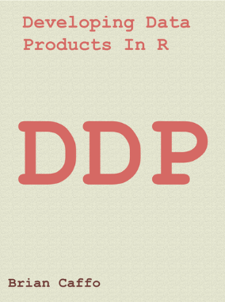

### About The Book
This book introduces the topic of Developing Data Products in R. A data product is the ideal output of a Data Science experiment. This book is based on the Coursera Class “Developing Data Products” as part of the Data Science Specialization. Particular emphasis is paid to developing Shiny apps and interactive graphics.

The book is available [here](https://leanpub.com/ddp)

It’s variable pricing, including free! It also includes some content (like leaflet) that was not covered in the class and omits some other. It’s a little rough, but as I work on it you’ll get all of the updates.

### About The Course
A data product is the production output from a statistical analysis. Data products automate complex analysis tasks or use technology to expand the utility of a data informed model, algorithm or inference. This course covers the basics of creating data products using Shiny, R packages, and interactive graphics. The course will focus on the statistical fundamentals of creating a data product that can be used to tell a story about data to a mass audience.

### About Shiny
Shiny is an important enough topic to devote a lot of time to it. Shiny is another product by RStudio and it is described by RStudio as “A web application framework in R”. They further add “Turn your analyses into interactive web applications No HTML, CSS, or JavaScript knowledge required”. This is mostly true, though a little HTML at least would be useful for understanding some of the concepts. Here’s a useful site for learning html basics. We’ll proceed as if your html knowledge is very basic and no more advanced than understanding heading levels for fonts. It is important to dinstiguish between a Shiny applications (app) and a Shiny server. A Shiny server is required to host a shiny app for the world. Otherwise, only those who have have shiny installed and have access to your code could run your web page (really defeating the purpose of making a web page in the first place).

In this class, we won’t cover creating a shiny server, as that requires understanding a little linux server administration. Instead, we’ll run our apps locally and use RStudio’s service for hosting shiny apps (their servers) on a platform called shinyapps.io. In other words, RStudio does the server work for your so that all you need to worry about is building your app. Shinyapps.io is free up to a point in that you can only run 5 apps for a certain amount of time per month. This will be fine for our purposes, but if you’re really going to get into making Shiny apps, you’ll have to spring for a paid plan or run your own server.

### Course Content
The lectures will be taught over four weeks with the third week dedicated to creating R packages.
The weeks are organized as follows:
1. Shiny, rCharts, manipulate, googleVis
2. Presenting data analysis, slidify, R Studio presenter.
3. Students creating and deploying their projects
4. Creating R packages, classes and methods, yhat.

### Course Project
The Course Project is an opportunity to demonstrate the skills you have learned during the course. It is graded through peer assessment. You must earn a grade of at least 80% to pass the course project.
