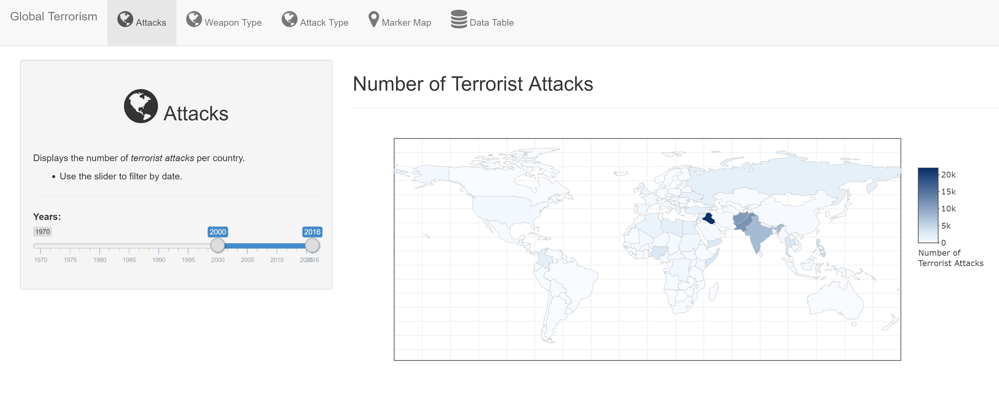

```{r setup, include=FALSE}
knitr::opts_chunk$set(echo = FALSE)
# install packages if necessary
list.of.packages <- c("knitr", "kableExtra")
new.packages <- list.of.packages[!(list.of.packages %in% installed.packages()[,"Package"])]
if(length(new.packages)) install.packages(new.packages)
```

### Global Terrorism
An interactive app to easily explore terrorism around the globe. The app utilizes the Global Terrorism Database (GTD) which is an open-source database including information on terrorist attacks around the world from 1970 through to 2016 containing more than 170,000 records.

- The database is maintained by researchers at the National Consortium for the Study of Terrorism and Responses to Terrorism (START)

- More information on the database can be found at <a href='http://start.umd.edu/gtd/'>here</a>.

### Global Terrorism
The app makes viewing the terrorism data much easier. It aggregates the data to be viewed on the world map by using plotly. The data can be further filtered by date, weapon type or attack type.
<br>
<br>
<center></center>

### Global Terrorism
The first 100 rows of the data being explored.

```{r, comment= ""}
library(knitr)
library(kableExtra)
terrorism <- read.csv('terrorism_short.csv')
kable(head(terrorism, 100), "html",align = "c") %>%
  kable_styling(font_size = 18, position = "center") %>%
  scroll_box(width = "800px", height = "435px")
```
